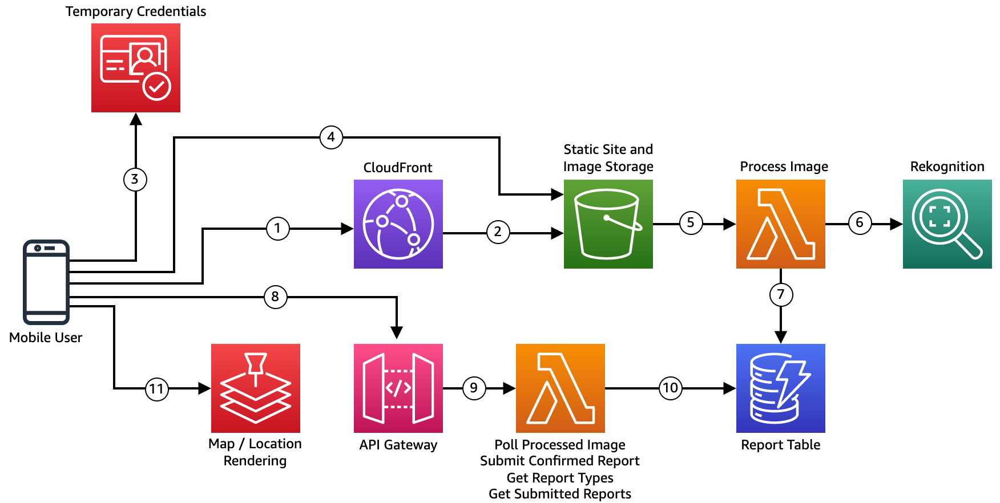
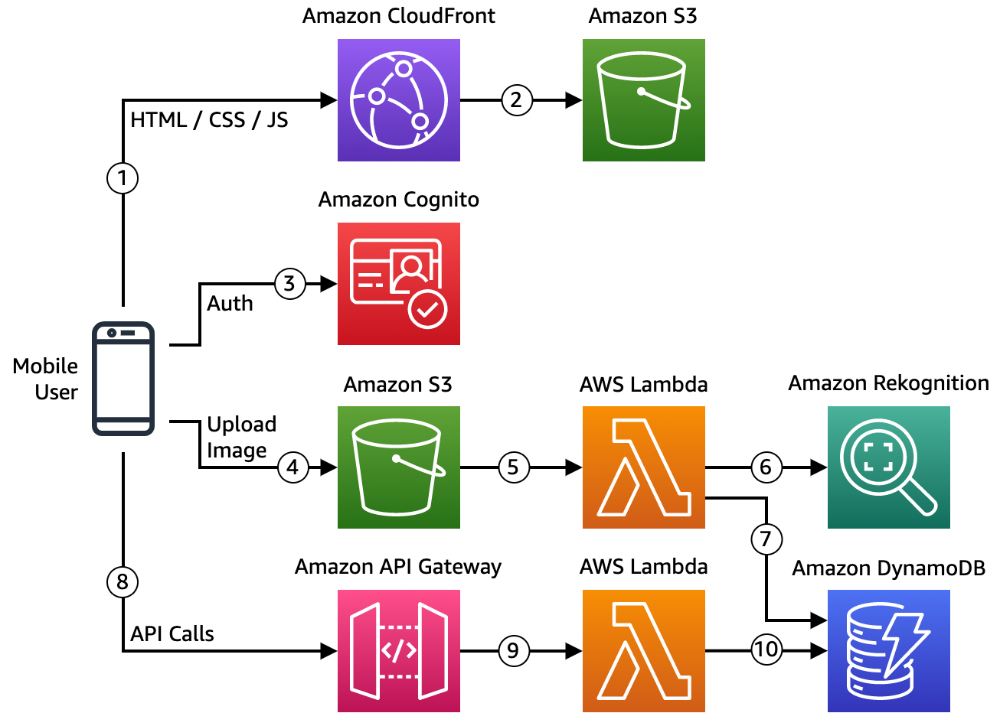
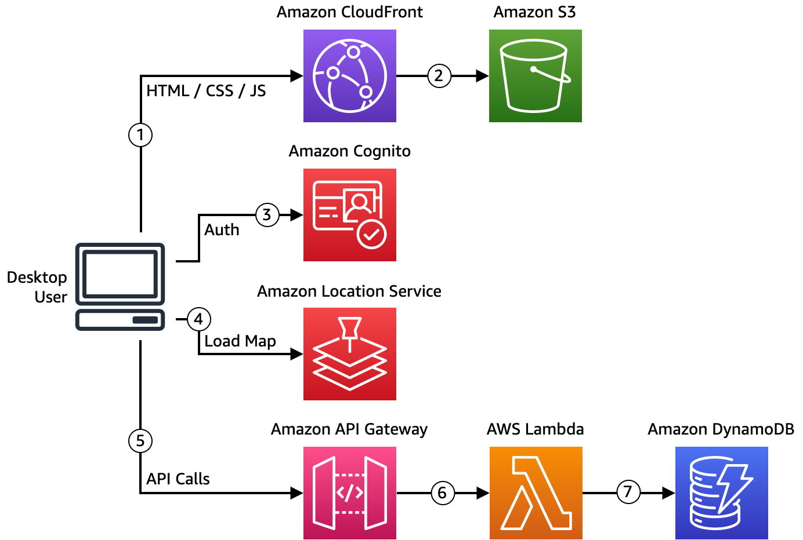

# Deep Learning Suggestion Example

AWS Public Sector News Blog: [Enhance the citizen experience with deep learning-powered suggestions](#)

This solution is an example of a government service in which citzens can submit images of damaged government or public property through a mobile website. When people upload images to the website, the solution uses machine learning (ML) to identify the type of damaged property, and then routes that information along with location data to the appriopriate government agency, where a government official can triage the issue for remediation.

For deployment instructions see [DEPLOYMENT](./docs/DEPLOYMENT.md).

## Architecture

## Workflows

This solution has two workflows, one for the citizen, and one for the government worker::

1. Citizen Workflow - Citizens load a mobile web page and submit a report of damaged government property by taking a picture of the damaged area.
2. Government Workflow - Government workers load a desktop web page and view a map of reported damage.

## Citizen Workflow

1. Mobile User accesses static website via CloudFront CDN
2. CloudFront CDN returns cached content, or retrieves the static site from the origin (S3 Bucket)
3. Static website loads and browser obtains temporary credentials from Cognito (used for S3 upload)
4. User uploads image to S3 bucket
5. S3 event triggers Process Image Lambda function
6. Lambda function requests Rekognition processes image, receives list of labels in the image
7. Lambda function retrieves list of possible reports from DynamoDB Report Table, compares that to Rekognition results, determines the recommendations, and saves it to the Reports Table
8. Immediately after step #3, the browser begins checking for the processed image results every 500ms via API Gateway.
9. Each API Gateway request calls a Lambda function to get report types or results from a processed image.
10. Lambda function retrieves the relevant data from the DynamoDB table. User makes a selection on the type of report they want to submit, and it is submitted via second 8-10 sequence.

## Government Workflow

1. Desktop User accesses static website via CloudFront CDN
2. CloudFront CDN returns cached content, or retrieves the static site from the origin (S3 Bucket)
3. Static website loads and browser obtains temporary credentials from Cognito (used for Map/Location Rendering)
4. Browser renders map from the Amazon Location Service
5. Browser requests all open submissions and report types from API Gateway
6. Each API Gateway request calls a Lambda function to get report types and open reports
7. Lambda function retrieves the relevant data from the DynamoDB table and passes it back to the browser. The worker eventually chooses to resolve the report, whose request follows the 5-7 steps marking the report resolved in the database.

## Security

See [CONTRIBUTING](CONTRIBUTING.md#security-issue-notifications) for more information.

## License

This library is licensed under the MIT-0 License. See the [LICENSE](LICENSE) file.
